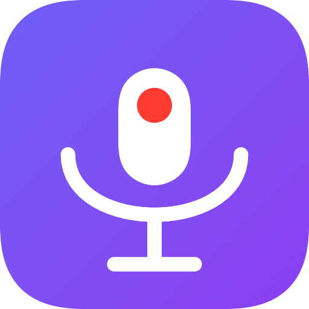
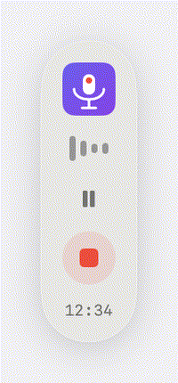
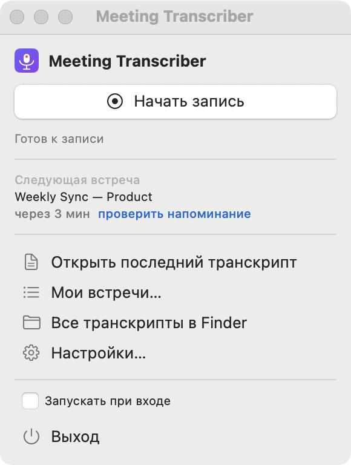
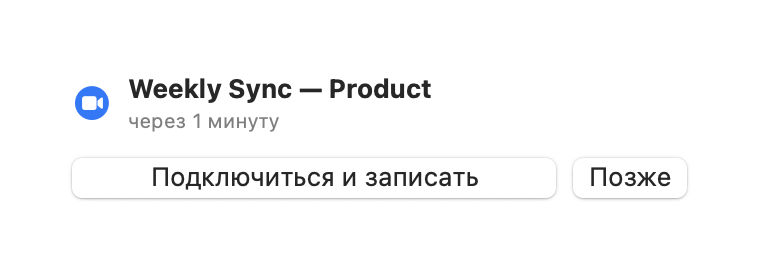

<div align="center">



# Meeting Transcriber

**Запись и транскрипция встреч на macOS — локально, на Apple GPU, с разметкой спикеров.**

Zoom · Google Meet · Teams · любое приложение со звуком. Ничего не уходит в облако.



</div>

---

## Что это

Menu-bar приложение для Mac, которое:

- 🎙️ записывает **звук встречи** (любого приложения — Zoom / Meet / Teams / браузер) **и ваш микрофон** в две раздельные дорожки;
- ⚡ транскрибирует **локально на Apple GPU** (Whisper large-v3 через [MLX](https://github.com/ml-explore/mlx)) — ~11× быстрее реального времени на M4 Pro, ничего не отправляется на сервер;
- 👥 размечает спикеров (кто говорит) через [pyannote](https://github.com/pyannote/pyannote-audio);
- 🔴 транскрибирует **на лету во время встречи** — после «Стоп» текст готов почти сразу;
- 📅 по желанию — всплывашка из Google Calendar за минуту до встречи: «Подключиться и записать».

Готовые транскрипты (с таймкодами и спикерами) складываются в `~/Documents/Транскрипты встреч/` — Markdown, работайте с ними как хотите.

## Интерфейс

<div align="center">

&nbsp;&nbsp;

</div>

<sub>Слева — окно в строке меню (запись/стоп, следующая встреча, автозагрузка). Справа — напоминание из календаря за минуту до встречи.</sub>

## Фичи

| | |
|---|---|
| **Две дорожки** | «Я» (микрофон) и собеседники (системный звук) пишутся раздельно → чистая разметка спикеров |
| **Локально и приватно** | аудио и транскрипты никогда не покидают ваш Mac |
| **Apple GPU** | Whisper через MLX (Metal) — на порядок быстрее CPU |
| **Live-транскрипция** | текст копится во время встречи; после «Стоп» остаётся только разметка спикеров |
| **Плавающий «Стоп»** | панель поверх всего, включая полноэкранный Zoom |
| **Календарь** | всплывашка «Подключиться и записать» перед встречей (Google Calendar) |
| **Без BlackHole** | системный звук через нативный ScreenCaptureKit — без виртуальных аудио-устройств |

## Как это работает

```
                 ScreenCaptureKit ──▶ system.caf (собеседники)
   [встреча] ──┤
                 AVAudioEngine ─────▶ mic.caf (вы)
                                          │
         live_transcribe.py (во время встречи, чанки на GPU)
                                          │
              Whisper (MLX) + pyannote (спикеры) + дедуп
                                          │
                          ~/Documents/Транскрипты встреч/*.md
```

## Требования

- **macOS 15 (Sequoia)** или новее (нужен ScreenCaptureKit с захватом микрофона).
- **Apple Silicon (M1–M4)** — для GPU-ускорения. На Intel-Mac будет работать, но заметно медленнее (только CPU).
- **Python 3.12** (ставится через Homebrew скриптом установки).
- ~5 ГБ на диске под модели (Whisper large-v3 + pyannote — скачиваются при первом запуске).
- Xcode Command Line Tools (`xcode-select --install`).

## Установка

### Просто (без терминала)

**1. Скачать.** На странице [Releases](https://github.com/Serg4356/meeting-transcriber/releases) нажмите **Source code (zip)** (или зелёная кнопка **Code → Download ZIP**). Браузер обычно распаковывает архив сам — открывайте получившуюся папку. Файл `.tar.gz`, если он тоже скачался, не нужен — можно удалить.

**2. Разрешить запуск (обязательный шаг).** Приложение пока **не заверено «печатью» Apple** (нотаризация появится позже), поэтому при первом запуске macOS его заблокирует. **Это ожидаемо, файл не вирус** — просто Apple не может подтвердить издателя. Как разрешить:

- **macOS 15 Sequoia и новее** (окно «Apple не удалось подтвердить, что файл не содержит вредоносного ПО»):
  1. В этом окне нажмите **«Готово»** — **не** «Переместить в Корзину».
  2. Откройте **Системные настройки → Конфиденциальность и безопасность**.
  3. Пролистайте вниз до раздела **«Безопасность»** — там будет строка «`install.command` заблокирован…» и кнопка **«Всё равно открыть»**. Нажмите её.
  4. Подтвердите Touch ID или паролем → в финальном окне **«Открыть»**.
- **macOS 13–14 (Ventura/Sonoma):** правый клик (Control-клик) по `install.command` → **Открыть** → **Открыть**.

**3. Установка.** `install.command` сам поставит всё необходимое (Homebrew, ffmpeg, Python-окружение), соберёт и установит приложение и по шагам спросит **токен Hugging Face** для разделения спикеров (можно пропустить — тогда собеседники будут без имён). Дождитесь **«Готово 🎉»**: приложение окажется в «Программах» и ярлыком на рабочем столе.

> - Нужен Mac на **Apple Silicon** (M1–M4).
> - При установке качается несколько ГБ — первый раз это надолго.
> - Первый запуск **самого приложения**: разрешите **«Запись экрана»** и **«Микрофон»**, когда система попросит, — без этого звук не запишется.
> - Одноразовая возня с блокировкой Apple уйдёт, когда появится нотаризованная сборка (`.dmg`) — тогда всё откроется в один клик.

### Вручную (для разработчиков)

```bash
git clone https://github.com/Serg4356/meeting-transcriber.git
cd meeting-transcriber

# 1. Python-окружение + зависимости (Whisper/MLX/pyannote/…)
./setup.sh

# 2. Собрать приложение (создаст /Applications/MeetingTranscriber.app + ярлык на столе)
cd app && ./package_app.sh
```

Запустите приложение и дайте два разрешения при первом старте:
**Системные настройки → Приватность → Запись экрана и системного звука** и **Микрофон**.

### Чтобы разрешения не слетали при пересборке (рекомендуется)

macOS привязывает разрешения к подписи приложения. Ad-hoc подпись меняется при каждой сборке → разрешения сбрасываются. Создайте разовый self-signed сертификат:

**Связка ключей → Ассистент сертификации → Создать сертификат…** → имя `Meeting Transcriber Self`, тип **Самоподписанный корневой**, тип сертификата **Подпись кода**.

`package_app.sh` автоматически подпишет им сборку, и разрешения будут держаться навсегда. (Без сертификата всё работает, но разрешения придётся давать после каждой пересборки.)

## Google Calendar — напоминания перед встречей (опционально)

Всплывашка «Подключиться и записать» за минуту до встречи. Разовая настройка (~10 мин):

1. [Google Cloud Console](https://console.cloud.google.com/) → создать проект.
2. **APIs & Services → Library** → включить **Google Calendar API**.
3. **APIs & Services → OAuth consent screen** → тип **Internal** (или External + добавить себя в Test users).
4. **Credentials → Create Credentials → OAuth client ID** → тип **Desktop app** → скачать JSON.
5. Переименовать скачанный файл в **`credentials.json`** и положить в корень проекта
   (шаблон структуры — [`credentials.json.example`](credentials.json.example)).
6. Авторизоваться (откроет браузер, разово):
   ```bash
   source .venv/bin/activate && python calendar_watch.py --auth
   ```

Без этого приложение работает как обычный рекордер — просто без напоминаний.

## Диаризация спикеров (опционально)

Чтобы в транскрипте были «Собеседник 1 / 2 / 3», а не одна метка:

1. Токен (Read): <https://huggingface.co/settings/tokens>
2. Принять условия модели: <https://huggingface.co/pyannote/speaker-diarization-community-1>
3. Скопировать [`.env.example`](.env.example) → `.env` и вписать `HF_TOKEN=...`

Без токена транскрипт соберётся, но собеседники пойдут одной меткой «Собеседник».

## Использование

1. Клик по иконке в строке меню → **Запись**.
2. Проведите встречу (звук любого приложения + ваш микрофон пишутся; текст транскрибируется на лету).
3. **Стоп** → через несколько секунд-минуту готовый транскрипт появится в
   `~/Documents/Транскрипты встреч/<дата время>.md`.

> 💡 **Наушники** заметно улучшают качество: без них микрофон слышит собеседников из динамиков, и в транскрипте появляется частичное дублирование.

## Скорость (замерено на M4 Pro)

- Whisper на GPU (MLX): **~11× реального времени** (120с аудио → ~10с).
- 57-минутная встреча целиком: ~10–15 мин обработки.
- С live-транскрипцией ожидание **после «Стоп»** сокращается в **3–5×** — whisper делается во время встречи, остаётся только разметка спикеров (~3 мин на часовую встречу).

### Учёт мощности машины

Приложение подбирает модель под железо, чтобы не тормозить слабый Mac (`capability.py`):

| RAM | Модель |
|---|---|
| 16 ГБ+ | `large-v3` (полное качество) |
| 10–16 ГБ | `large-v3-turbo` (легче/быстрее) |
| 8–10 ГБ | `medium` |
| < 8 ГБ | `small` |

Live-транскрипция во время встречи запускается в **фоновом приоритете** (`taskpolicy -b`) — не отнимает ресурсы у Zoom и переднего плана. Вручную: `python transcribe.py <сессия> --resource-mode low` (ещё бережнее) или `--model large-v3` (форсировать).

## ⚠️ Согласие на запись

Запись разговоров и встреч **без уведомления и согласия участников незаконна** во многих странах и штатах (two-party consent). Используя это приложение, **вы обязаны получить согласие всех участников** до начала записи и соблюдать применимое законодательство. Авторы не несут ответственности за неправомерное использование.

## Как устроен код

- `Recorder.swift` — захват (ScreenCaptureKit + AVAudioEngine) в две `.caf`.
- `transcribe.py` — whisper (MLX) + диаризация (pyannote) + дедуп протечки мик/система.
- `live_transcribe.py` — live-режим: чанки скользящим окном во время записи.
- `calendar_watch.py` — опрос Google Calendar.
- `app/` — Swift menu-bar приложение (SPM), сборка `.app` через `package_app.sh`.

## Лицензия

[MIT](LICENSE)
